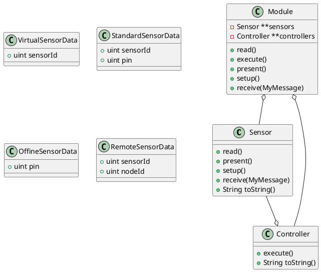

# **Custom Serial Gateway for Arduino based on [MySensors](https://www.mysensors.org/)**

Implementacja OOP MySensors USB Serial Gateway na potrzeby integracji np. z Domoticzem.

Oprogramowanie to odpowiedzialne jest za całą "smart" automatykę oraz integracje wszystkich sensrowów oraz nodów MySensors w inteligentnym budynku. 

## Założenia projektowe

Celem projektu jest stworzenie Biblioteki (Fasady) do SDK Arduino oraz biblioteki MySensors.

Powstałe w ten sposób rozwiązanie ma za zadanie udostępnienie prostego narzędzia do konfiguracji sensorów (wejść oraz wyjść), niezbędnych do automatyzacji wymaganej w projekcie Smart Summer House.

Programista powinien tworzyć jedynie obiekty, ich konfigurację oraz listy obiektów powiązanych, reszta powinna działać automatycznie.

Aplikacja posiadać powinna wbudowaną logikę. Zadaniem logiki będzie obsługa automatycznego budynku. Celem takiego działania jest zapewnienie niezależności o wyższych warstwa np. Domoticza. 

Oprogramowanie powinno być modułowe, każdy z modułów powinien obsługiwać swój obszar:
* Oświetlenie
* Alarm
* Ogrzewanie
* Kominek
* Monitoring warunków klimatycznych zewnętrznych, stacja pogody
* Monitoring warunków klimatycznych wewnętrznych
* Monitoring bezpieczeństwa użytkownika oraz budynku – pożar, gaz, zalanie
* Sterowanie kolektorami wodnymi i rezerwuarem wody ciepłej
* Automatyczne podlewanie
* Nastrój - barwa, intensywność światła
* Oświetlenie automatyczne
* Zasilanie awaryjne

W związku z ogromną ilością dostępnych sensorów zestaw gotowych klas wspierać będzie tylko wybrane potrzebne do realizacji projektu, przy którego okazji powstaje ten kod ;p .

## Urządzenia i technologie

### Mózg

* Arduino Mega - Gateway
* Arduino * - MySensors Node

### Technologie

* MySensors
* RS485 - Między Gateway a Node
* nRF24L01+ 2.4GHz  - Między Gateway a Nod
* UART over USB - do Domoticza (opcja A)
* Ethernet ENC28J60 SPI - do Domoticza (Opcja B)
* Ethernet + MQTT - (Opcja C)

### Sensory

* DHT22
* cyfrowy natężenia światła BH1750 GY-302
* a gazów MQ-4 (metan)
* gazów łatwopalnych i dymu MQ-2
* ruchu PIR HC-SR501
* //TODO

## Założenia architektoniczne

### Model warstwy abstrakcyjnej dla architektury


### Typy klas w module

* `Sensor` Sensory – odczytujące, zmieniające stan
* `Controller` Decydujące – decydujące o działaniach klas Wykonawczych
* `Module` Instalujące moduł, zapewniające mu interakcje z Arduino

#### Rodzaje sensorów

* `Binary`
* `Analog`

### Rodzaje sensorów

Rozróżnić możemy 3 główne rodzaje sensorów:
* `Virtual` – tylko w MySensors
* `Offline` – tylko Arduino
* `Standard` = `Offline` + `Virtual` –  Arduino + MySensors
* `Remote` – z innego node MySensors, ale jesteśmy zainteresowani jego wartością. – tylko dostępy tylko na Gateway.

#### Konfiguracja PINów oraz ID Sensorów

Do konfiguracji mapowania wejść i wyjść używa się predefiniowanych typów danych `struct`:
* `VirtualSensorData` – sensory, guziki – obiekty które występują tylko w MySensors
* `SensorData` – sensory, guziki które są związane z Pinem oraz występują w MySensors
* `OffineSensorData` – sensory, guziki które są związane z Pinem i nie występują w MySensors
* `RemoteSensorData` – sensor zdalny dostępny w node MySensors. 

W pliku sensor_configuration.hpp zgodnie z przykładem należy przygotować swoją konfigurację mapowań portów. 

### Definiowanie, konfigurowanie, grupowanie obiektów

//TODO
* Wskaźniki
* Tablice wskaźników


## Moduły

* [x] Core - ```core```
* [x] Oświetlenie - ```light```
* [ ] Alarm - ```alarm```

### Core - ```core```

Klasy współdzielone dla wszystkich modułów do standaryzacji ów modułów oraz pilnowania konwencji architektury.

### Oświetlenie - ```light```

Sterowanie oświetleniem, włączanie, wyłączanie, strefy. 

#### Urządzenia fizyczne

* Relay 230V * ?A = max ???W
* Monochromatyczny włącznik ścienny
* Lampy oświetleniowe 230V.

#### Funkcje

* Włączanie / Wyłączanie lampy
* Włączanie / Wyłączanie strey
* Włącz wszystko
* Wyłącz wszystko
* Migaj światłem
* Włącz na określony czas
* Czy jest włączone?

#### Model klas

https://www.visual-paradigm.com/guide/uml-unified-modeling-language/uml-aggregation-vs-composition/

```plantuml
@startuml

class Lamp {
}

class LightButton {
}

class LightZone {
}

Lamp --|> Sensor
Lamp --|> Binary

LightButton --|> Binary
LightButton --|> Sensor

LightZone --|> Sensor
LightZone --|> Binary

LightZone o-- Lamp
LightButton o-- Lamp

@enduml
````


### Alarm - ```alarm```

Moduł odpowiedzialny za obsługę alarmu w budynku z prostymi funkcjami tj.: naruszenia, strefy, sterowanie syreną. 

Informacje pochodzić będą z 2 typów sensorów:
* Wewnętrznych – obsługiwanych przez MySensors, np. czujnik ruchu, dźwięku, drgań, kontaktron.
* Zewnętrznych – wyzwalanych przez API np. Domoticza, np. informacje z OpenCV.

Sensory mogą być podzielone na strefy, które mogą być niezależnie zabezpieczane i odbezpieczane. 

Zabezpieczanie oraz odbezpieczanie alarmu możliwe będzie za pomocą kanałów:
* Sensor z MySensors np. PinPad, RfId, wykrycie adresu MAC urządzenia BT
* Wyzwalanych przez API z np. Domoticza
* np. Domoticza

Alarm powinien posiadać przynajmniej 3 tryby pracy:
* Odbezpieczony – Wszystkie strefy odbezpieczone
* Zabezpieczony – Wszystkie strefy zabezpieczone
* Mieszany 
* (NiceToHave) Automatyczny – strefy powinny się zabezpieczać i odbezpieczać automatycznie zależnie od obecności w nich autoryzowanych użytkowników 

W przypadku wykrycia naruszenia powinny wykonywać się następujące czynności:
* Zmieniać się stan sensora MySensors dla np. Domoticza, który na podstawie tej informacji wyśle e-maila, SMS lub Push’a
* Uruchamiać syrenę wizualną 
* Uruchamiać syrenę dźwiękową wewnętrzną (jak naruszenie nie ustąpi w ciągu ?s)
* Uruchamiać syrenę dźwiękową zewnętrzną (jak naruszenie nie ustąpi w ciągu ?s)
* Wysyłać SMS jeśli będzie podpięty do Arduino Modem GSM.
 
#### Urządzenia fizyczne

* Czujnik ruchu
* Mikrofon
* Sensor drgań
* Kontaktron
* Dane z OpenCV*

#### Model klas

```plantuml
@startuml
class Armable {
+ bool armed;
+ void arm();
+ void disarm()
+ bool isArmed()
+ virtual void sendArmedStatus();
}
class Zone {
}
class Siren {
}
class BinarySensor {
}
class AnalogSensor {
}
class ArmSwitch {
}
class AlarmController {
}



Zone o-- BinarySensor
Zone o-- BinarySensor
Zone o-- AnalogSensor
Zone o-- ArmSwitch

AlarmController o-- Zone
AlarmController o-- ArmSwitch
AlarmController o-- Siren


Zone --|> Binary
Zone --|> Controller
Zone --|> Armable
Siren --|> Binary
Siren --|> Sensor
BinarySensor --|> Sensor
BinarySensor --|> Armable
BinarySensor --|> Binary
AnalogSensor --|> Analog
AnalogSensor --|> Armable
AnalogSensor --|> Binary
ArmSwitch --|> Sensor
ArmSwitch --|> Binary
AlarmController --|> Controller
AlarmController --|> Binary
AlarmController --|> Armable
@enduml
```



#### Urządzenia fizyczne
#### Funkcje


## Przykładowa Konfiguracja VSCode

### .vscode/c_cpp_properties.json

```
{
    "configurations": [
        {
            "name": "Mac",
            "defines": [
                "ARDUINO=10800",
                "USBCON",
                "__AVR_ATmega2560__"
            ],
            "includePath": [
                "${workspaceRoot}",
                "${workspaceRoot}/**",
                "/Applications/Arduino.app/Contents/Java/hardware/arduino/avr/**",
                "/Applications/Arduino.app/Contents/Java/tools/**",
                "/Applications/hardware/tools/**",
                "/Applications/libraries/**",
                "/Users/true/Documents/Arduino/hardware/tools/**",
                "/Users/true/Documents/Arduino/libraries/**",
                "/Applications/Arduino.app/Contents/Java/hardware/tools/avr/**"
            ],
            "forcedInclude": [
                "/Applications/Arduino.app/Contents/Java/hardware/arduino/avr/variants/mega/pins_arduino.h",
                "/Applications/Arduino.app/Contents/Java/hardware/arduino/avr/cores/arduino/Arduino.h"
            ],
            "intelliSenseMode": "gcc-x64",
            "cStandard": "c11",
            "cppStandard": "c++17",
            "compilerPath": "/usr/bin/clang"
        }
    ],
    "version": 4
}
```
### .vscode/arduino.json

```
{
    "port": "/dev/cu.usbserial-14A220",
    "board": "arduino:avr:mega",
    "configuration": "cpu=atmega2560"
}
```

